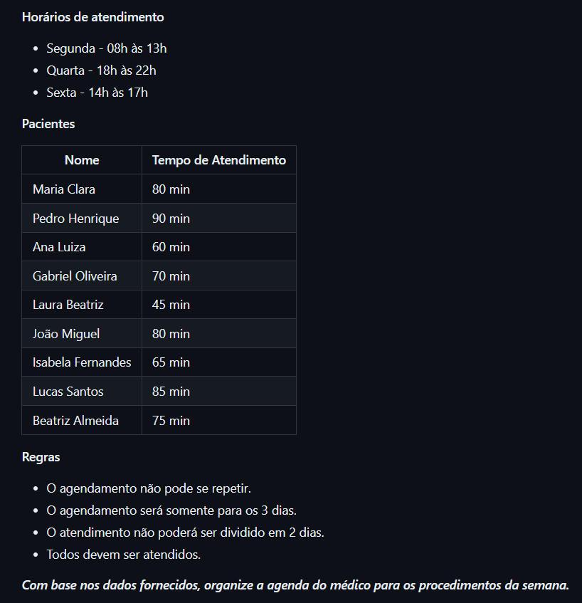

# Teste 1 - Lógica
Um cirurgião dentista possui uma agenda disponível para atendimento e precisa agendar os pacientes para a semana. 

> A resolução do problema foi desenvolvida em JavaScript, seguindo as orientações do enunciado.

## Tecnologias 💻

- JavaScript
- GIT
- GITHUB

## Contato 📧

devraccoonleo@gmail.com
